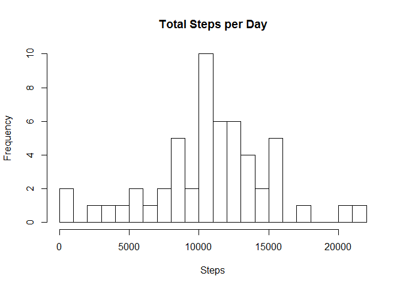
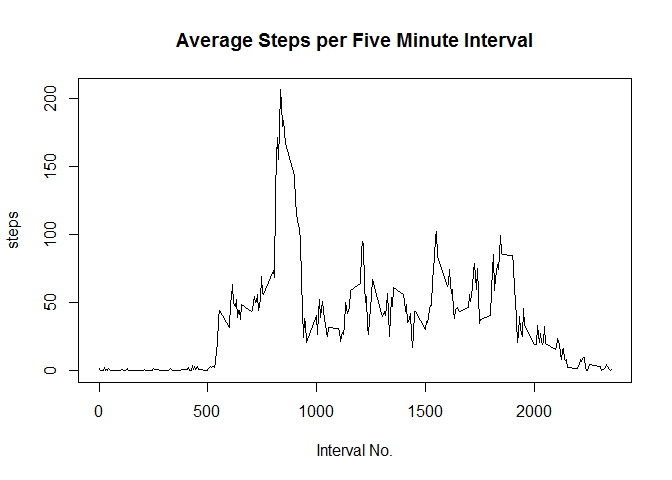
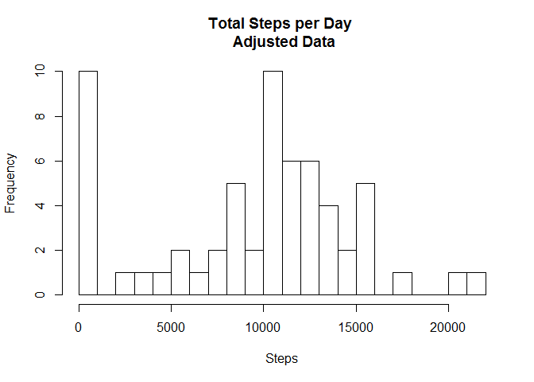
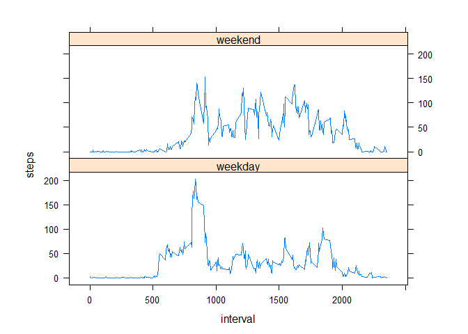

# Reproducible Research: Peer Assessment 1
Author: Doris Liu
Date: 05/15/2016
===========================

## Loading and preprocessing the data

```r
setwd("C://Users/DorisLiu/Desktop/RepData_PeerAssessment1/RepData_PeerAssessment1/activity")
d<-read.csv("activity.csv")
library(knitr)
```

```
## Warning: package 'knitr' was built under R version 3.2.5
```

```r
opts_chunk$set(echo = TRUE)
```
## What is mean total number of steps taken per day?
1.Calculate the total number of steps taken per day

```r
agg_data <- aggregate(steps ~ date, data=d, sum, na.rm = TRUE)
```
2.If you do not understand the difference between a histogram and a barplot, research the difference between them. Make a histogram of the total number of steps taken each day

```r
hist(agg_data$steps, breaks=20, main="Total Steps per Day", xlab="Steps", ylab="Frequency")
```

<!-- -->

3.Calculate and report the mean and median of the total number of steps taken per day

```r
step_mean <- mean(d$steps, na.rm=TRUE)
step_median <- median(d$steps, na.rm=TRUE)
print(paste("The mean steps per day is: ", step_mean))
```

```
## [1] "The mean steps per day is:  37.3825995807128"
```

```r
print(paste("The median steps per day is: ", step_median))
```

```
## [1] "The median steps per day is:  0"
```
## What is the average daily activity pattern?
1.Make a time series plot (i.e. type = "l") of the 5-minute interval (x-axis) and the average number of steps taken, averaged across all days (y-axis)

```r
stepsdata <- aggregate(steps ~ interval, data=d, mean, na.rm=TRUE)
plot(stepsdata$interval, stepsdata$steps, type="l", main="Average Steps per Five Minute Interval", xlab="Interval No.", ylab="steps")
```

<!-- -->

2.Which 5-minute interval, on average across all the days in the dataset, contains the maximum number of steps?

```r
maxsteps <- max(stepsdata$steps)
print(paste("The maximum number of steps in a five minute interval was: ", maxsteps))
```

```
## [1] "The maximum number of steps in a five minute interval was:  206.169811320755"
```

## Imputing missing values
1.Calculate and report the total number of missing values in the dataset (i.e. the total number of rows with NAs)

```r
missingValues <- sum(is.na(d$steps))
print(paste("There are", missingValues, "missing values in the dataset."))
```

```
## [1] "There are 2304 missing values in the dataset."
```

2.Devise a strategy for filling in all of the missing values in the dataset. The strategy does not need to be sophisticated. For example, you could use the mean/median for that day, or the mean for that 5-minute interval, etc. Median was choosen for replacing the missing value here.

```r
NaReplaceddata <- d
```

3.Create a new dataset that is equal to the original dataset but with the missing data filled in.

```r
NaReplaceddata$steps[is.na(NaReplaceddata$steps)] <- median(d$steps, na.rm=TRUE)
```

4.Make a histogram of the total number of steps taken each day and Calculate and report the mean and median total number of steps taken per day. Do these values differ from the estimates from the first part of the assignment? What is the impact of imputing missing data on the estimates of the total daily number of steps?

```r
NaReplaceddataByday <- aggregate(steps ~ date, data=NaReplaceddata, sum, na.rm=TRUE)
hist(NaReplaceddataByday$steps, breaks=20, main="Total Steps per Day \n Adjusted Data",
     xlab="Steps", ylab="Frequency")
```

<!-- -->

```r
steps_mean <- mean(NaReplaceddata$steps)
steps_median <- median(NaReplaceddata$steps)
print(paste("The mean is: ", steps_mean))
```

```
## [1] "The mean is:  32.4799635701275"
```

```r
print(paste("The median is: ", steps_median))
```

```
## [1] "The median is:  0"
```
According to the result, they have same median and smaller mean. Replacing NAs into median reduces the mean but no influence on median.

## Are there differences in activity patterns between weekdays and weekends?
1.Create a new factor variable in the dataset with two levels – “weekday” and “weekend” indicating whether a given date is a weekday or weekend day.

```r
NaReplaceddata$date <- as.Date(NaReplaceddata$date)
NaReplaceddata$dayname <- weekdays(NaReplaceddata$date)
NaReplaceddata$weekend <- as.factor(ifelse(NaReplaceddata$dayname == "星期六" | NaReplaceddata$dayname == "星期日", "weekend", "weekday"))
```
2.Make a panel plot containing a time series plot (i.e. type = "l") of the 5-minute interval (x-axis) and the average number of steps taken, averaged across all weekday days or weekend days (y-axis). See the README file in the GitHub repository to see an example of what this plot should look like using simulated data.

```r
library(lattice)
plotdata <- aggregate(steps ~ interval + weekend, NaReplaceddata, mean)
xyplot(steps ~ interval | factor(weekend), data=plotdata, aspect=1/3, type="l")
```

<!-- -->
